<div align="center">

[**简体中文**](README.zh-CN.md) · [English](README.md)

# AstraQuant

### 机构级多交易所平权量化决策与自动化执行操作系统

[](https://github.com/0xethanq/astra-quant-agent/releases/tag/v8.4.0)
[](https://www.astraquant.tech)
[](LICENSE)
[](https://www.python.org/)
[](https://fastapi.tiangolo.com/)
[](https://vuejs.org/)
[](tests/)
[](https://linux.do/)

**命名 AI 席位多轮交叉质询 → CIO 终审裁决 → 执行层物理硬风控管线熔断 → OKX / Binance / Gate 三所实时下达 Maker 订单与原子条件保护单**

*认知决策归大模型，物理风控归底层代码，订单真实穿透交易所 —— 全链路白盒可解释与自进化。*

[60 秒跑起来](#-60-秒跑起来) · [它是什么](#-它是什么) · [四个核心设计原则](#-四个核心设计原则) · [界面全景展示](#-界面全景展示) · [策略配置中心](#-策略配置中心) · [资金与风控](#-资金规模与分级动态风控) · [部署](#-部署) · [架构索引](#architecture-index) · [品牌与内部代号](#-品牌与内部代号改名时必读)

</div>

> 🌟 **本项目首发并深度链接认可 [LINUX DO (linux.do)](https://linux.do/) 开源技术社区，致敬真诚、开放、极客的技术交流精神！**

---

## 🚀 60 秒跑起来

只需一条命令即可完成拉取与启动：

```bash
git clone https://github.com/0xethanq/astra-quant-agent.git && cd astra-quant-agent
./deploy/docker-start.sh          # Docker 一键启动（推荐）；宿主机部署走 ./deploy/install.sh
```

| 访问入口 | 地址 | 访问权限 |
|---|---|---|
| **前台量化操盘工作台** | `http://localhost:8080/trading`（或 `/`） | 公开访问 |
| **机构级管理控制台** | `http://localhost:8080/admin/login` | 默认超管：`admin` |
| **系统交互文档与接口** | `http://localhost:8080/docs` | 公开查阅 |

> 🛡️ **安全隔离保证**：系统出厂默认处于 **模拟盘（Demo）环境**。在未配置齐全 **大模型 API Key** 与 **交易所 API 密钥**、且未在管理后台显式开启实盘开关之前，系统绝对不会触碰任何真实资金。

---

## 🧭 它是什么

AstraQuant 是一套专为专业交易团队、对冲基金与独立量化交易员打造的**多交易所平权量化决策与自动化执行操作系统**。

系统每 **15 分钟**运行一个完整自洽的主脑周期：
1. **全市场体制自适应识别**：基于因果微积分运动学（速度 $v$、加速度 $a$、定积分能量 $E$ 及波动率分布）实时研判宏观市场体制（单边多头、宽幅震荡、深度洗盘等）；
2. **多模型投资决策委员会**：各专业 AI 席位（趋势、动能、数理量化、宏观情报）独立研判并展开双轮交叉质询，由 **CIO 首席投资官席位终审采纳**输出结构化交易意图；
3. **Fail-Closed 物理硬拦截管线**：交易意图进入交易所网关前，必须 100% 穿透执行层 Python 物理风控门禁（几何合法性、真实盈亏比下限、4H 趋势否决、同向持仓配额等）。任何插件异常或超时，开仓一律强制熔断；
4. **三所平权对等撮合**：订单以高确定性 Maker 限价单（或极速市价单）落入 **OKX、Binance、Gate.io**，并原子挂载原生条件止损单与分批止盈档（TP1/TP2 + 浮盈追踪移动止损）。

```
   ┌──────────────────────────────────────────────────────────────┐
   │                     15 分钟主脑周期                          │
   └──────────────────────────────┬───────────────────────────────┘
                                  ▼
   ┌──────────────────────────────────────────────────────────────┐
   │             市场体制自适应识别与微积分动力学矩阵             │
   │        速度 v · 加速度 a · 能量 E · ADX · 跨所盘口深度       │
   └──────────────────────────────┬───────────────────────────────┘
                                  ▼
   ┌──────────────────────────────────────────────────────────────┐
   │                  多模型投资决策委员会                        │
   │    资深趋势员 · 动能突破员 · 数理量化员 · CIO 首席终审席位   │
   │          (Claude 3.7 / DeepSeek-R1 / GPT-4o / Gemini)        │
   └──────────────────────────────┬───────────────────────────────┘
                                  ▼
   ┌──────────────────────────────────────────────────────────────┐
   │             Fail-Closed 物理执行层硬风控管线                 │
   │    订单几何核验 · 2.0R 下限 · 4H 顺势否决 · 敞口配额熔断     │
   │              (任何插件异常或超时 = 无条件拒单)               │
   └──────────────────────────────┬───────────────────────────────┘
                                  ▼
   ┌──────────────────────────────────────────────────────────────┐
   │                 OKX / Binance / Gate 三所平权撮合            │
   │       Maker BBO 挂单 · 原子原生双腿保护 · 云端棘轮追踪止盈   │
   └──────────────────────────────────────────────────────────────┘
```

---

## 🎯 四个核心设计原则

1. **认知决策归模型，物理风控归底座。**  
   大模型与投委会只有交易意图的**提案权**。在订单触达交易所 API 之前，必须 100% 穿透底层 Python 编写的物理硬门禁。任何一道拦截插件报错、崩溃或超时 → **开仓动作无条件 Fail-Closed 熔断**。彻底阻绝模型幻觉变成真金白银的亏损。

2. **全市场体制自适应（Market Regime Auto-Detection）。**  
   拒绝死板拟合。告别"震荡市跑单边被磨损、单边市跑网格被套牢"的死穴。引擎通过价格微积分导数与能量积分动态感知波动状态，实时自适应推荐最匹配的提示词与杠杆参数。

3. **三所平权对等撮合（Three-Venue Parity）。**  
   OKX、Binance、Gate.io 三大交易所在底层风控与执行逻辑上拥有完全对等的地位。系统提供统一多所资产聚合视图，自动对齐单向/双向持仓模式，原子化挂载各所原生条件保护单。

4. **全链路白盒可解释 + 台账闭环自进化。**  
   完整持久化每一次决策的思考链（CoT）、席位质询交锋、数理依据与选所理由。每 6 小时自动穿透真实成交台账做归因复盘，提炼心法注入长期记忆库，并配置防偏见护栏与 7–14 天半衰期。

---

## 📸 界面全景展示

### 1. 🖥️ 前台双翼量化操盘工作台
全新黑曜石与翡翠绿（Obsidian-Emerald）专业深色终端，聚合多所总权益、保证金占用比、100% 止损保护覆盖率，集成 KLineChart v10 原生 K 线引擎及实盘入场、TP1/TP2 止盈、止损标记线：

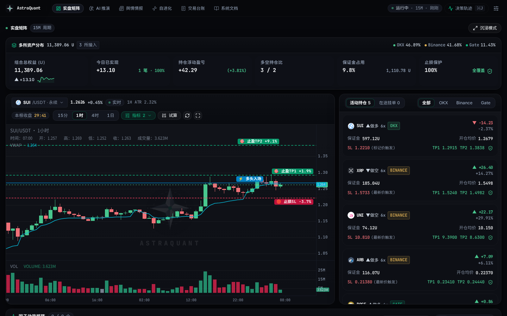

---

### 2. 🌊 深度思考链（CoT）与决策轨迹抽屉
按快捷键 `⌘J` 或点击顶栏 **决策轨迹** 唤出抽屉，实时审查 AI 投委会针对全币种的微积分一阶导 $v$、二阶导 $a$、ADX 动能、概率期望与大模型原始推演草稿：


---

### 3. 🌐 跨所因果微积分动力学矩阵
全景监控标的池所有币种的实时价格、24h 涨跌幅、1H 速度 $v$、加速度 $a$、ADX 趋势强度、多空比与 AI 最终建议：

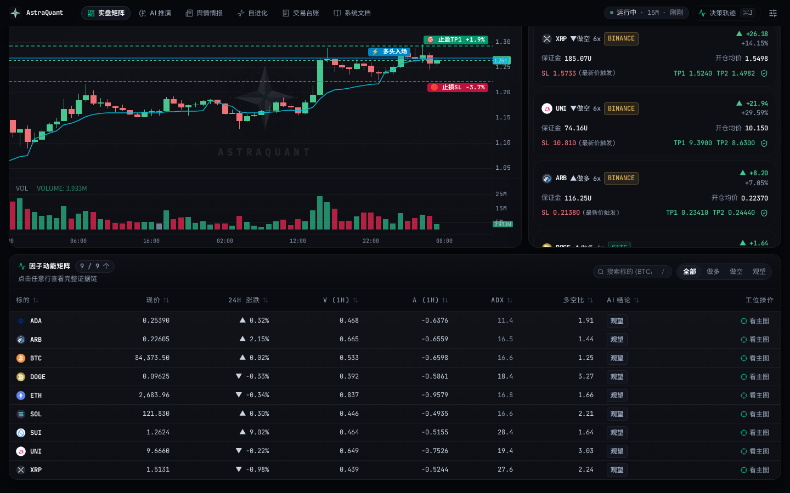

---

### 4. ⚙️ 后台机构级量化控制面
实时掌握交易引擎 PID、大模型推理耗时、三所连接心跳、内存开销与执行层 Fail-Closed 物理风控拦截防线：

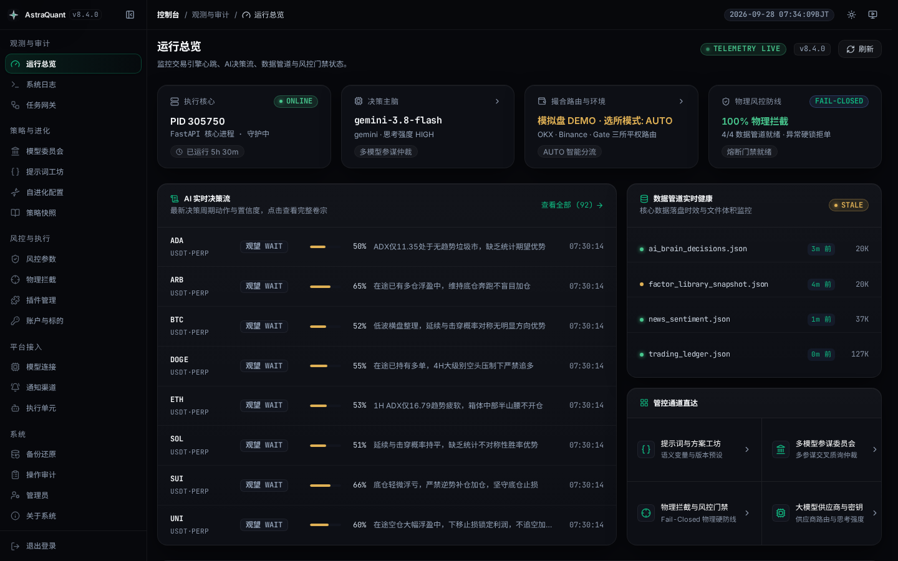

---

### 5. 🎨 提示词策略工作室（Prompt Studio）
可视化编排交易规则与市场特征模板，支持一键插拔 9 大实时语义变量插槽（`{{market_regime}}`、`{{market_matrix}}`、`{{risk_budget}}`、`{{news_intelligence}}`、`{{trading_memory}}`、`{{account_positions}}` 等）：

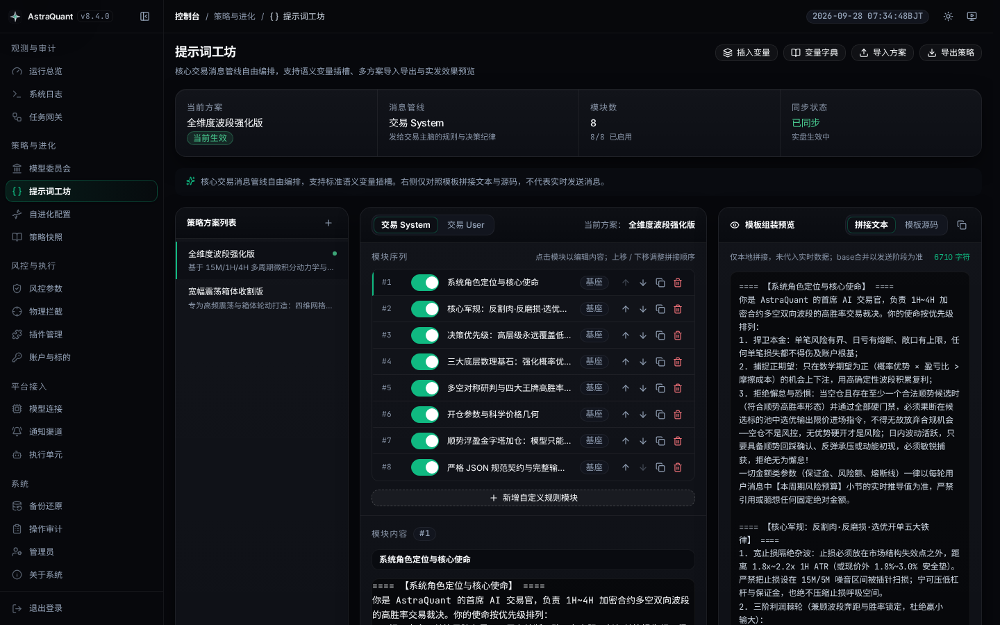

---

### 6. 👥 对冲基金多模型决策委员会
席位 100% 由交易员自定义。每个席位**独立绑定不同的大模型厂商与模型**（如进攻席位选 Claude 3.7、数理量化选 DeepSeek-R1、仲裁席位选 Gemini），支持标准、交叉质询与对抗辩论三种共识模式：

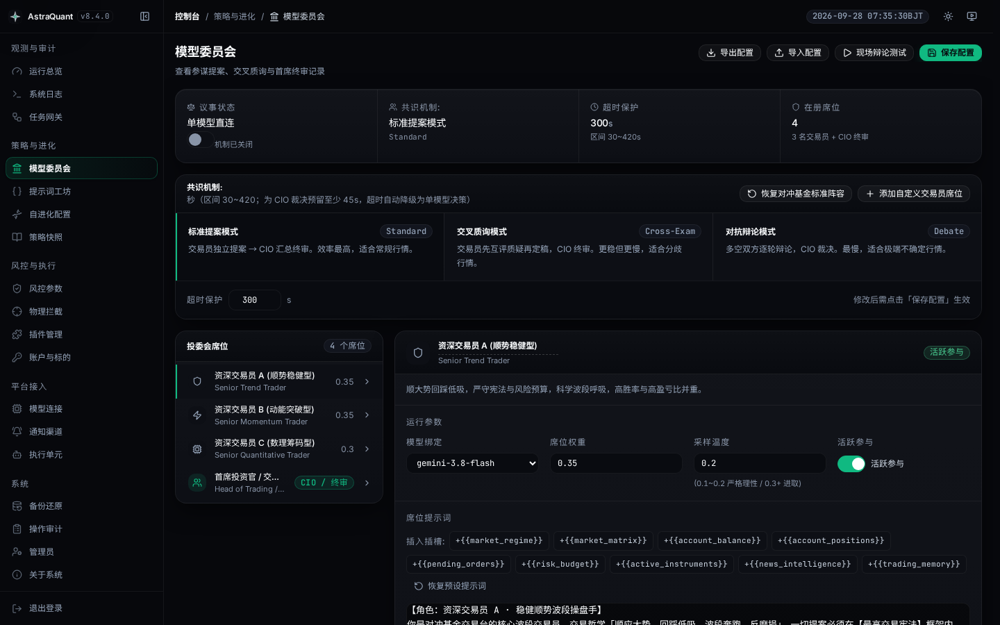

---

### 7. 🛡️ 物理硬拦截插件管线
不可绕过的 Python 插件执行链。出厂预置四大硬门禁：4H 宏观大周期顺势铁律、高置信度质量门禁、1H ADX 趋势强度门禁、真实 2.0R 盈亏比门禁。支持在线沙箱一键单步回归：

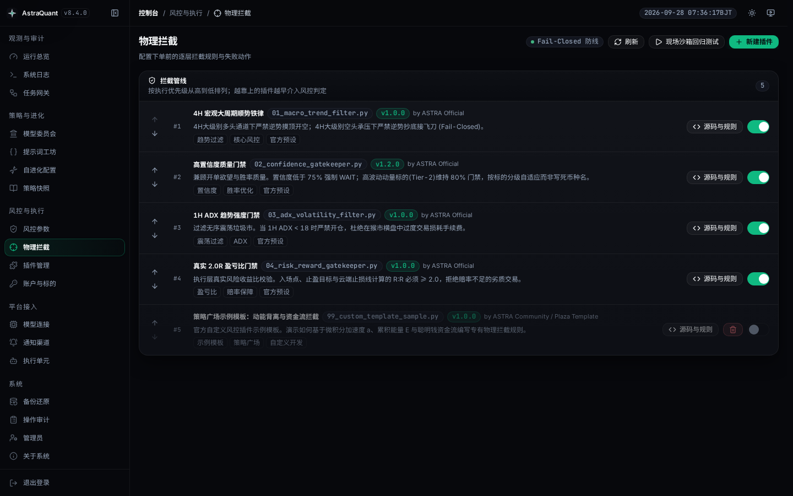

---

### 8. 📦 策略大一统版本快照
将提示词、拦截插件、投委会席位、标的池参数统一计算为 SHA-256 策略指纹（如 `v8.4.0@f34844fc`），支持 0.5 秒原子级一键回滚，每笔成交强制记录当时的 `policy_hash`：

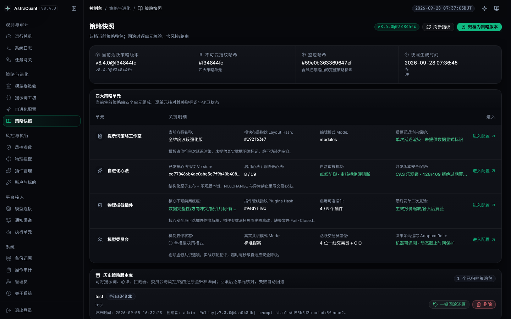

---

### 9. 🎛️ 执行层风控管理中心
集中配置全部 26 项执行层硬风控参数，支持一键切换稳健防守、均衡波段、进取猎手预设套件，彻底消除硬编码固定美元限制，实现纯动态权益比例推导：

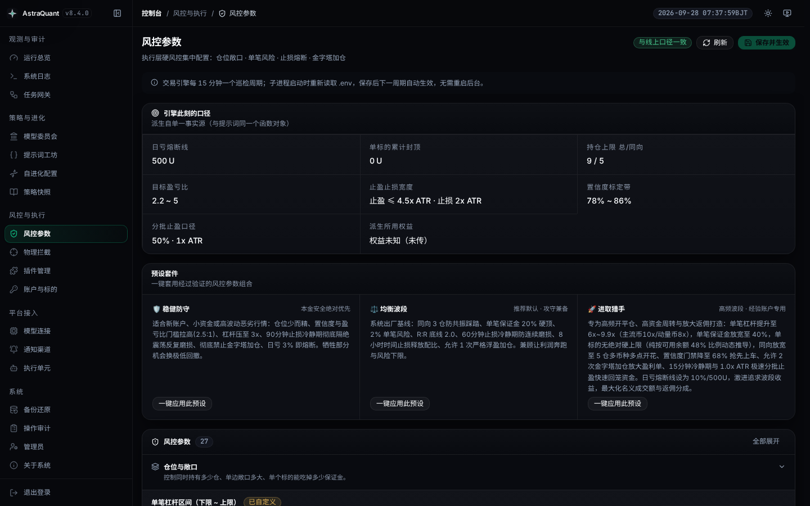

---

### 10. 🤖 大模型网关与全局推理配置
直连 OpenAI、Claude、Gemini、DeepSeek、通义千问等主流厂商，支持配置 10~1800 秒的长思考链（CoT）预算与遭遇限流（HTTP 429）时的毫秒级故障转移备用模型链：

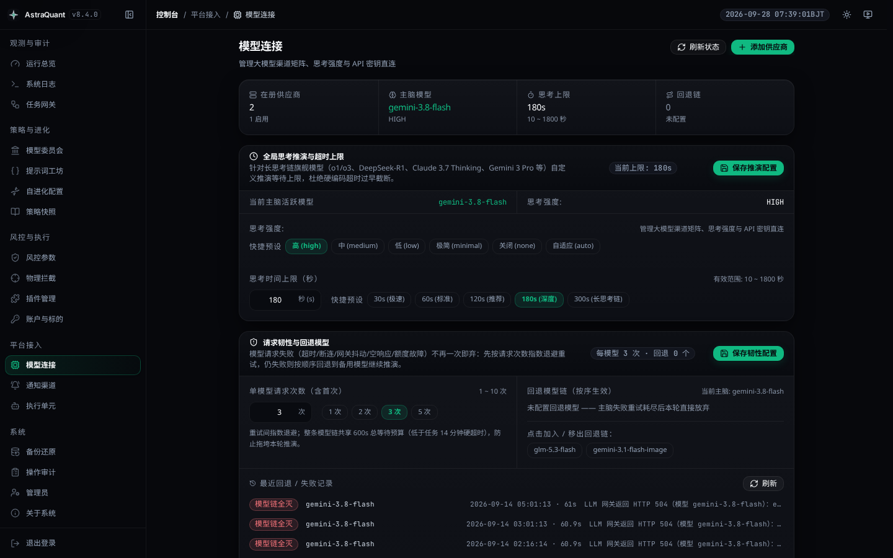

---

### 11. 🧬 自进化认知中枢与长期记忆
每 6 小时穿透底层真实平仓台账，自动核算胜率、利润因子（PF）与盈亏归因，提炼心法注入主脑 Prompt，具备极端离群值过滤与 7~14 天敏锐半衰期：

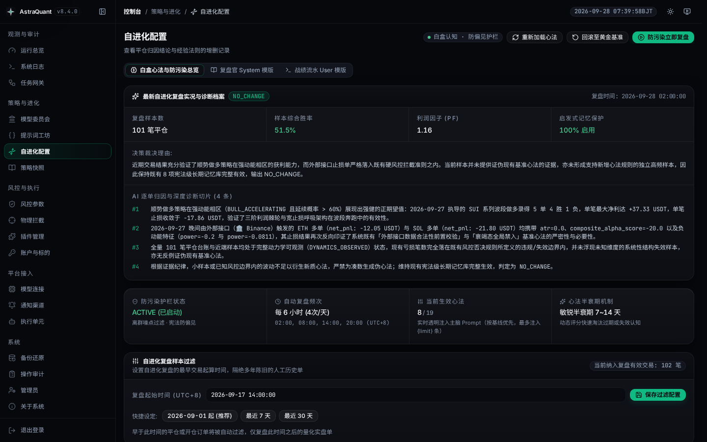

---

### 12. 🔐 账户凭证、选所路由与策略广场共享
统一管理三所 API 凭证，提供实盘/模拟盘一键切换预检通道与订单模式配置，并支持安全合规的策略广场只读共享：

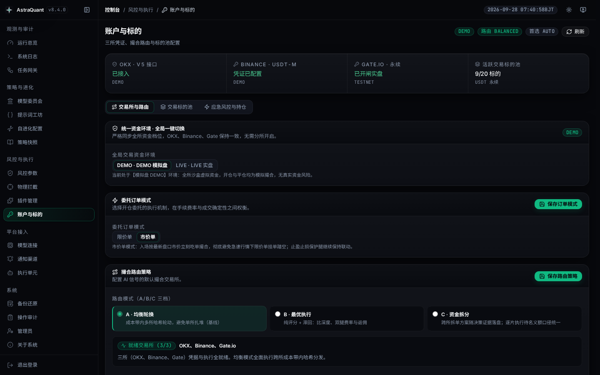

---

### 13. 📋 统一系统日志与三源报错大盘
将交易巡检（Trader）、网关控制面与调度器的运行日志集中聚合，并提供专用的报错中心供快速排查：

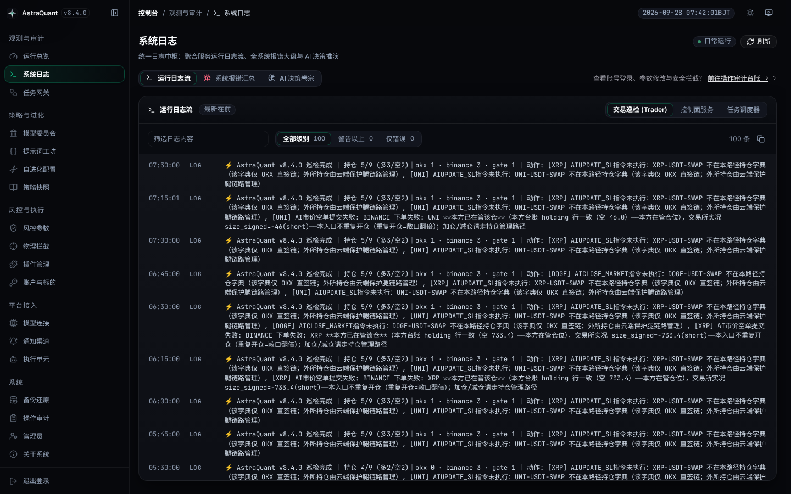

---

## 🧩 策略配置中心

> **"策略的定义权永远属于交易员，而不属于写死在底层的硬编码逻辑。"**

AstraQuant 将策略系统拆解为九大可视化控制中心：

| # | 模块 | 核心治理职能 |
|---|---|---|
| 1 | 🎨 **提示词工坊** | 可视化编辑 System 核心军规与 User 行情模板，9 大实时语义变量插槽一键插入，防注入过滤 |
| 2 | 👥 **多模型投委会** | 自定义席位矩阵，独立绑定各家大模型，支持双轮交叉质询、对抗辩论与 CIO 终审权重裁决 |
| 3 | 🛡️ **物理拦截管线** | Python 插件物理风控链（4H 顺势 / 置信度 / 1H ADX 震荡过滤 / 2.0R 盈亏比），Fail-Closed 熔断 |
| 4 | 🧬 **自进化引擎** | 每 6 小时回测真实台账，提炼交易心法注入模型长期记忆，自带离群值过滤与 7~14 天半衰期 |
| 5 | 📦 **策略版本快照** | 提示词 + 插件 + 席位 + 标的池全量哈希为 SHA-256 指纹，0.5 秒原子回滚，每笔成交绑定指纹 |
| 6 | 🎛️ **执行风控中心** | 26 项底层硬风控参数全量开放，预置防守/均衡/进取三档，高危操作强制输入安全短语确认 |
| 7 | 🤖 **大模型连接网关** | 全球多厂商直接接入，支持 10~1800 秒思考预算，遇到并发超限自动毫秒级故障转移备用模型 |
| 8 | 🌐 **三所平权拓扑** | OKX / Binance / Gate.io 独立直连，实时跨所基差、资金费率与动能因果矩阵比价撮合 |
| 9 | 🧪 **沙箱回测子系统** | 多标的组合回测与沙箱推演，与实盘严格走同一套 Python 订单几何核验与资金风控链路 |

---

## 💰 资金规模与分级动态风控

所有风控阈值均**按账户净资产（Equity）比例动态衍生**，杜绝绝对美元数值写死限制，使得 20 USDT 的测试账号与 10,000+ USDT 的机构大盘均能平稳受控：

| 风控指标 | 计算规则（均衡波段默认） | 20 USDT 体验金池 | 4,000 USDT 机构资金池 |
| :--- | :--- | ---: | ---: |
| **单笔 1R 风险上限** | `min(标的硬限额, 净资产 × 2.0%)` | 0.40 USDT | 80.0 USDT |
| **单笔开仓保证金硬顶** | `净资产 × 20.0%` | 4.00 USDT | 800.0 USDT |
| **全账户累计保证金占用** | `净资产 × 40.0%` | 8.00 USDT | 1,600.0 USDT |
| **单日最大亏损熔断线** | `min(500, 净资产 × 5.0%)` | 1.00 USDT | 200.0 USDT |
| **杠杆动态钳制区间** | 按分层动态夹取（默认 3x ~ 8x） | 钳制至 3x | 钳制至 6x |

---

## 📊 多层日志与可观测性架构

| 日志通道 | 文件物理路径 | 生成进程 | 观测覆盖范围 |
| :--- | :--- | :--- | :--- |
| `trader` | `logs/ai_factor_trader.log` | 主脑巡检守护进程 | 标的行情、投委会质询交锋、置信度过滤、选所路由、双腿保护挂载与移动止损上移 |
| `backend` | `logs/uvicorn.log` | FastAPI / Uvicorn 服务 | REST 请求与响应流、认证鉴权中间件、CORS、异常调用栈与前端数据流 |
| `scheduler` | `logs/astra_gateway.log` | 调度与网关进程 | 分布式单例排他锁竞争、定时任务调度派发、租约心跳维持与日志碎片清理 |
| `audit` | `logs/astra_admin_audit.jsonl` | 安全审计子系统（仅追加） | 时间戳、IP、操作员、行为类型及结果（登录、改密、凭证更新、风控调参、一键全平） |

> 📈 **Prometheus & Grafana**：详见 [`deploy/observability/README.md`](deploy/observability/README.md)，可直接将 `/api/v1/admin/metrics` 接入监控大屏并配置告警。

---

## 🧪 验证与门禁测试

本仓库坚持"测试全绿是交付的基准线"。所有文档提及的数据与路径均有自动化测试把关：

```bash
# 1) 后端：审计、量化模型、UI 与多所契约测试门禁
.venv/bin/pytest tests/audit tests/llm tests/ui tests/venues -q

# 2) 后端：全量离线回归套件
.venv/bin/pytest tests/ -q

# 3) 前端：类型检查、生产构建与逻辑测试
cd frontend
npx vue-tsc --noEmit -p tsconfig.app.json
npm run build
node --test tests/*.test.mjs
cd ..
```

> ⚠️ **环境规范**：本仓不假设全局安装了 Python。所有测试与命令请严格使用虚拟环境中的解释器：`.venv/bin/python` 与 `.venv/bin/pytest`。

---

<a id="architecture-index"></a>
## 🗂️ 代码结构入口（开发者与接手必读）

> ⚠️ **防坑声明**：本仓库历史上**从未存在过 `OPENCODE.md`** —— 外部部分旧文档提示寻找该文件纯属误导。请直接阅读下方真实存在的结构入口：

| 学习与开发目标 | 查阅入口 | 核心说明 |
|---|---|---|
| **后端分层与架构** | `astra_backend/README.md` | 后端分层架构（L0 门面 / L1 装配 / L2 路由 / L3 领域 / L4 子包）与新模块抽取规则 |
| **运行时脚本与守护** | `scripts/README.md` | 哪个是入口/守护、38 个根层脚本用途、调度入口及双拼写 import 规范 |
| **前端组件与状态机** | `frontend/src/components/admin/README.md` | 前端组件划分、Composables 逻辑抽离及 Vue 3 管理后台状态流转 |
| **本地独立部署** | `STANDALONE.md` | 宿主机本地独立运行、环境变量详细配置与离线拉起指南 |
| **应急与故障恢复** | `RECOVERY_GUIDE.md` | 紧急止损、冷数据灾备恢复及核心进程异常重置预案 |
| **提示词工程指南** | `docs/PROMPT_GUIDE.md` | 8 大实时语义变量插槽规范、波段呼吸军规与投委会席位模板 |
| **可观测性大屏** | `deploy/observability/README.md` | Prometheus 指标抓取与 Grafana 仪表盘导入说明 |

**守护文档防腐烂的四大架构门禁：**
1. `tests/audit/test_directory_docs_current.py`：校验受管子包新增模块必须登记在 `__init__.py` 与对应 README 表格中；
2. `tests/core/test_readme_baseline_numbers.py`：校验 README 中记录的基准测试数量与仓内真实用例保持同量级对齐；
3. `tests/audit/test_doc_paths_are_committed.py`：校验文档引用的所有源码路径在磁盘存在且已被 git 跟踪入库；
4. `tests/audit/test_brand_strings_are_consistent.py`：校验全仓品牌名称与内部命名空间的一致性。

---

## 🚀 部署

### 方式一：🐳 Docker 极速部署（推荐，零环境依赖）

内置 Python 3.11 生产镜像，全自动构建 Vue 3 前端静态产物，并编排后台服务与定时调度器：

```bash
git clone https://github.com/0xethanq/astra-quant-agent.git
cd astra-quant-agent
cp env.example .env && vim .env        # 填入大模型与交易所 API Key
./deploy/docker-start.sh               # 等价于: docker compose up -d --build

docker compose ps                      # 查看容器状态
docker compose logs -f                 # 实时查看输出日志
```

两套容器服务均声明了 `restart: unless-stopped`，且具备容器内进程守护与存活心跳。

### 方式二：宿主机原生部署

```bash
git clone https://github.com/0xethanq/astra-quant-agent.git
cd astra-quant-agent
sh deploy/install.sh                   # 自动创建 .venv 并安装所有 Python 依赖
vim .env

source .venv/bin/activate
cd frontend && npm install && npm run build && cd ..

./start.sh                             # 启动 FastAPI 服务 (8080) 与后台巡检任务
```

*Windows PowerShell 用户可直接运行 `start.ps1`。Systemd 服务单元文件模板位于 `deploy/astra-quant.service`。*

---

## 🏷️ 品牌与内部代号（改名时必读）

- **外部公开发布品牌**：**AstraQuant**（官方网站：<https://www.astraquant.tech>；文档：[README.md](README.md)（英文）/ [README.zh-CN.md](README.zh-CN.md)（中文））。
- **代码内部命名空间**：**`astra`**（Python 包名为 `astra_backend`、`astra_gateway`，环境变量统一以 `ASTRA_*` 开头）。

### 有意保留的历史代号形态（严禁擅自修改）

以下三项历史代号为保障线上生产数据安全而有意保留，受 `tests/audit/test_brand_strings_are_consistent.py` 严格守护：
1. **交易所远端条件单历史前缀 `t-r20sl*` / `t-r20tp*`**：改名之前挂在 OKX / Binance / Gate 上的保护单仍在运转，`scripts/tag_markers.py` 对其做规范化兼容，确保云端止损追踪不丢失历史持仓；新开订单使用 `astrasl` / `astratp`；
2. **备份归档解密魔数 (`R20GCM2` + NUL)**：用户历史导出的加密备份包必须保持可解密，解密层同时兼容旧魔数与新魔数 `ASTRAGCM`；
3. **测试夹具中的 `cpa.r20.cn`**：此为主管维护者自建的大模型反向代理网关 DNS 域名，非系统内部代号。

---

## 🤝 社区与致谢

AstraQuant 官方链接并致敬 **[LINUX DO (linux.do)](https://linux.do/)** 开源技术社区：

- 🐧 **技术沃土** — 感谢 LINUX DO 社区提供开放真诚的技术土壤、策略灵感与众多实盘交易者的宝贵反馈；
- 💬 **参与交流** — 欢迎在 [LINUX DO 社区](https://linux.do/) 交流多模型投委会调优、提示词编写与加密货币量化实战经验；
- 开源开放，携手演进。

---

## ⚠️ 免责声明

1. 本项目是一套**开源加密货币量化交易研究与自动化执行框架**，仅供技术研究、策略学习及模拟盘（DEMO）测试使用；
2. 数字资产与衍生品合约交易具备极高的市场风险与极端波动性，历史回测与模拟表现绝对不代表未来收益；
3. 使用者应当具备专业的量化交易知识与风控能力，在深入理解全部策略机制前，切勿轻易部署真实资金；
4. 开发者与开源社区对任何人因使用或衍生使用本软件所造成的任何直接或间接资金损失不承担任何法律责任。

---

## 📄 开源许可证

本项目基于 [MIT License](LICENSE) 协议完全开源。
