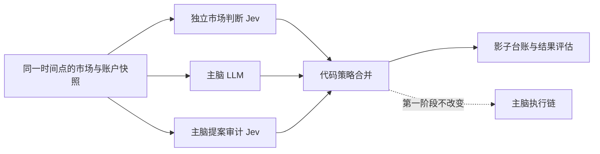

# Jev 独立决策与主脑提案审计改造方案

## 1. 目标

把 Jev 从“看到主脑提案后判断是否合理”的单一路径，改成两个相互隔离的决策面：

1. **独立市场判断**：Jev 只看时间点固定的市场、执行成本和风险事实，独立给出 `BUY_LONG`、`SELL_SHORT`、`WAIT` 或 `INSUFFICIENT_DATA`。
2. **主脑提案审计**：Jev 看到主脑提案后，检查提案是否被证据支持、是否追价、止损和盈亏比是否合理、是否遗漏反向证据。

主脑仍然是当前实际执行者。第一阶段所有 Jev 结果都只写入影子台账，不改变开仓、平仓、撤单或持仓管理。

改造要解决的核心问题是：

- 主脑的“动量高、方向明确、适合进场吗？”这类带结论前提的问题，会诱导 Jev 做条件确认。
- 当前请求虽然在 `state.proposals` 中移除了部分主脑字段，但同一个 `state.audit_context.proposals` 仍携带 `action`、`confidence`、入场价、止损和止盈。独立问题因此仍可能看到主脑结论。
- 当前 `UNKNOWN` 同时表示数据不足、动作分歧和置信度不足，无法区分 Jev 的真实判断和输入质量问题。

## 2. 非目标

- 不在本阶段让 Jev 直接发单。
- 不让 Jev 计算精确仓位、杠杆、保证金、止损价格、止盈价格或收益金额。
- 不用 Jev 替代代码中的账户隔离、订单保护、仓位上限、费用计算和交易所确认。
- 不把两个模型的一致率当作策略有效性的证明。
- 不新增测试文件。实现阶段使用现有测试、`py_compile`、`git diff --check`、沙箱冒烟和影子台账检查。

## 3. 目标数据流



独立判断和提案审计必须使用两个不同的 state。可以并行发起两个 HTTP 请求，但不能把两个 state 合并成一个请求后再依靠问题名称区分，因为 Jev 的所有问题都会看到同一个 state。

## 4. 三种输入对象

### 4.1 `neutral_market_state`

这是独立市场判断唯一允许看到的候选输入。字段应保持中性，不出现主脑动作或主脑结论。

```json
{
  "snapshot": {
    "instId": "ARB-USDT-SWAP",
    "observed_at": "2026-09-25T15:00:00+08:00",
    "candle_ts_4h": 1790308800000,
    "candle_ts_1h": 1790312400000,
    "candle_ts_15m": 1790313300000
  },
  "market": {
    "price": 0.25,
    "bid": 0.2499,
    "ask": 0.2500,
    "trend_4h": "BULLISH|BEARISH|RANGE|UNKNOWN",
    "regime_1h": "TREND|RANGE|CHOP|UNKNOWN",
    "momentum_15m": "POSITIVE|NEGATIVE|MIXED|UNKNOWN",
    "volatility": "LOW|NORMAL|HIGH|UNKNOWN",
    "volume_state": "EXPANDING|CONTRACTING|NORMAL|UNKNOWN",
    "funding_state": "LONG_EXPENSIVE|SHORT_EXPENSIVE|NEUTRAL|UNKNOWN",
    "open_interest_state": "RISING|FALLING|FLAT|UNKNOWN",
    "price_position_in_range": "LOW|MIDDLE|HIGH|UNKNOWN",
    "bullish_evidence": [],
    "bearish_evidence": []
  },
  "execution": {
    "fee_bps": 5,
    "slippage_bps": 2,
    "spread_bps": 1,
    "minimum_order_value_usdt": 0,
    "liquidity_state": "SUFFICIENT|THIN|UNKNOWN"
  },
  "risk_context": {
    "new_entry_allowed_by_code": true,
    "same_direction_position_count": 0,
    "cooldown_active": false,
    "circuit_breaker_active": false
  },
  "data_quality": {
    "status": "valid|partial|invalid",
    "missing_fields": [],
    "stale_fields": []
  }
}
```

`bullish_evidence` 和 `bearish_evidence` 必须同时保留。代码可以把指标转换成有限的语义桶，避免要求 Jev 做精确数学运算；但不能只把主脑已经总结好的“方向明确”作为事实传入。

### 4.2 `neutral_position_state`

用于独立判断持仓是否继续持有、平仓或更新保护。它可以包含当前仓位事实，但不包含主脑的持仓指令和理由。

允许字段包括：`side`、`pos`、`avgPx`、`markPx`、`upl`、`opened_at`、`lever`、`margin_usdt`、`liqPx` 及其状态、交易所保护单、保护覆盖率、市场状态和费用滑点。

禁止字段包括：`main_action`、`main_reason`、`main_confidence`、主脑建议止损价以及主脑本轮的平仓理由。

### 4.3 `audit_state`

提案审计可以看到同一时间点的中性市场/持仓事实，也可以看到主脑提案，但提案必须放在清晰的 `main_proposal` 字段下：

```json
{
  "neutral_market_state": {},
  "neutral_position_state": {},
  "main_proposal": {
    "action": "BUY_LONG|SELL_SHORT|WAIT",
    "entry_price": 0,
    "stop_loss_price": 0,
    "take_profit_price": 0,
    "leverage": 0,
    "margin_usdt": 0,
    "reason": "",
    "decision_id": "",
    "cycle_id": ""
  }
}
```

独立请求不得包含 `audit_state`，审计请求不得被误记为独立判断。

## 5. Jev 问题设计

### 5.1 独立市场判断问题

候选开仓使用一个 `Choice`，选项固定为：

- `BUY_LONG`
- `SELL_SHORT`
- `WAIT`
- `INSUFFICIENT_DATA`

问题说明应使用中性措辞：

> Based only on the supplied point-in-time market state, what is the best action for the next defined observation window? Choose `BUY_LONG`, `SELL_SHORT`, `WAIT`, or `INSUFFICIENT_DATA`. Do not assume any prior proposal or analyst conclusion.

同时在同一个独立请求中并行加入原子问题：

- `data_sufficient`：数据是否足够支持方向判断。
- `market_regime`：`BULL_TREND`、`BEAR_TREND`、`RANGE`、`CHOP`、`UNKNOWN`。
- `long_evidence`：多头证据是否达到预定义语义等级。
- `short_evidence`：空头证据是否达到预定义语义等级。
- `entry_is_chasing`：当前价格是否已经追涨或追空。
- `execution_risk_high`：费用、滑点、盘口或流动性是否足以破坏执行优势。
- `tail_risk_present`：是否存在明显的事件或结构性尾部风险。

TypeSafe 当前使用的接口无法稳定接受 `Choice`，实现因此暂用三个 Noul 兼容分
（`would_buy_long` / `would_sell_short` / `would_wait`）选出最高分动作。三个值是
独立分数，不是互斥分类概率：**不得归一化成和为 1 的分布**。代码必须同时检查
最高原始分是否达到绝对门槛，以及它与次高原始分的启发式分离度；低绝对分不得因
归一化而被放大成高置信方向。原始三票必须完整落盘。

### 5.2 独立持仓管理问题

持仓使用另一个 `Choice`：

- `HOLD`
- `CLOSE_MARKET`
- `UPDATE_SL`
- `INSUFFICIENT_DATA`

问题必须明确“只根据 neutral position state 判断”，不让 Jev看到主脑当前选择。

### 5.3 主脑提案审计问题

审计请求可以使用 `Noul`，由代码组合为审计结论：

- `thesis_supported`：主脑提案是否被中性市场事实支持。
- `direction_conflict`：提案方向是否与多周期证据冲突。
- `entry_is_chasing`：提案入场是否追价。
- `stop_is_structurally_valid`：止损是否位于方向正确的失效位置之外。
- `reward_after_cost_is_sufficient`：扣除费用和滑点后是否仍满足最低要求。
- `proposal_omits_counter_evidence`：提案是否忽略反向证据。
- `proposal_data_complete`：提案是否具备审计所需字段。

不要只问一个“是否批准”。最终 `APPROVE`、`REVIEW`、`REJECT` 由代码依据硬门槛、这些原子结果和置信度组合得到。

## 6. 代码策略合并规则

新增内部状态，不直接覆盖主脑动作：

- `jev_independent_action`
- `jev_independent_confidence`
- `jev_independent_action_margin`
- `jev_independent_data_status`
- `jev_audit_verdict`
- `jev_audit_flags`
- `jev_relation_to_main`: `AGREE`、`WAIT_VS_ENTRY`、`MAIN_WAIT_JEV_ENTRY`、`OPPOSITE_DIRECTION`、`ABSTAIN`、`AUDIT_REJECT`
- `jev_enforcement`: `SHADOW`、`REVIEW`、`SOFT_VETO`、`HARD_VETO`

第一阶段的合并规则：

1. 代码硬性风险门禁失败，直接记录 `AUDIT_REJECT`，不需要 Jev 证明。
2. 主脑是 `WAIT` 时，Jev 可以独立给出方向，但只记录“潜在机会”，不执行。
3. 主脑准备开仓且 Jev 给出相同方向，只记为 `AGREE`，不能自动批准。
4. 主脑准备开仓且 Jev 明确选择 `WAIT`，记录 `WAIT_VS_ENTRY`；若方向票因
   `low_confidence`、`ambiguous` 或 `not_ready` 被代码降级为 `WAIT`，记录 `ABSTAIN`。
5. 主脑准备开仓且 Jev 给出反向方向，记录 `OPPOSITE_DIRECTION`，暂不改变主脑执行。
6. Jev 为 `INSUFFICIENT_DATA` 时记录 `ABSTAIN`，不能当作反向信号。
7. 审计发现结构性错误时记录 `AUDIT_REJECT`，第一阶段仍只影子记录。

后续只有在影子评估证实有效后，才允许配置 `SOFT_VETO`。建议配置项为：

```text
ASTRA_JEV_INDEPENDENT_ENABLED=1
ASTRA_JEV_ENFORCEMENT=shadow
ASTRA_JEV_INDEPENDENT_MIN_CONFIDENCE=0.70
ASTRA_JEV_NO_EDGE_MIN_CONFIDENCE=0.54
ASTRA_JEV_INDEPENDENT_MIN_ACTION_MARGIN=0.15
ASTRA_JEV_VETO_WAIT_MIN_CONFIDENCE=0.70
ASTRA_JEV_VETO_MIN_ACTION_MARGIN=0.15
ASTRA_JEV_AUDIT_MIN_CONFIDENCE=0.70
ASTRA_JEV_HARD_VETO_ONLY_CODE_GATES=1
```

`shadow`、`review`、`soft_veto` 必须可配置回滚，不得通过修改代码切换。

`ASTRA_JEV_NO_EDGE_MIN_CONFIDENCE` 只负责生成可观测的 `no_edge` 标签，不得直接
充当否决门槛。明确 WAIT 要成为软否决依据，还必须独立通过
`ASTRA_JEV_VETO_WAIT_MIN_CONFIDENCE` 和 `ASTRA_JEV_VETO_MIN_ACTION_MARGIN`；反向方向
同样必须重新通过通用的 `ASTRA_JEV_VETO_MIN_ACTION_MARGIN`，不能只依赖分类门槛。

截至 2026-09-26 的双通道观测样本中，WAIT 票最高值低于 `0.70`，因此明确 WAIT
否决路径处于“休止”状态，预期不会产生候选。`SOFT_VETO_CANDIDATE=0` 只能说明
当前门槛未被触及，不能据此证明否决逻辑有效；接通执行前必须基于已结算的样本外
结果重新标定。

## 7. 推荐的代码落点

实现 agent 应优先沿用现有 Jev 影子层，不重写交易执行链：

1. 在 `scripts/ai_brain_trader.py` 中拆出独立 state 和 audit state 的构造函数，禁止 `_run_jev_shadow_review` 继续把两类 state 合并。
2. 将单一 `_run_jev_shadow_review` 拆成三个内部步骤：
   - `build_jev_independent_state`
   - `build_jev_audit_state`
   - `run_jev_shadow_requests`
3. 两个请求使用同一个冻结周期快照，并行调用 Typesafe；分别记录 endpoint、model、provider、request id、state hash 和 latency。
4. 在 `scripts/trader/` 下新增纯策略合并模块，例如 `jev_policy.py`，只接收主脑结果、独立 Jev 结果、审计结果和硬门禁结果，不做网络请求和下单。
5. 保留现有 `jev_shadow_reviews.jsonl` 兼容读取，同时为新记录增加 `schema_version=3`、`independent_review`、`audit_review` 和 `decision_relation`。
6. 候选和平仓结果继续按 `decision_id`、`cycle_id`、`entry_order_id` 关联，禁止按同标的和时间近似猜测。
7. `UNKNOWN` 只保留给兼容旧数据；新记录使用 `INSUFFICIENT_DATA`、`ABSTAIN`、`REVIEW` 等可区分状态。

伪代码：

```python
neutral_state = build_jev_independent_state(snapshot)
audit_state = build_jev_audit_state(snapshot, main_proposal)

independent_result, audit_result = parallel(
    ask_jev(neutral_state, independent_questions),
    ask_jev(audit_state, audit_questions),
)

policy_result = combine_in_code(
    main_decision=main_decision,
    independent=independent_result,
    audit=audit_result,
    hard_gates=hard_gates,
)

persist_shadow_review(
    neutral_state_hash=hash_json(neutral_state),
    audit_state_hash=hash_json(audit_state),
    main_decision=main_decision,
    independent=independent_result,
    audit=audit_result,
    policy=policy_result,
)
```

## 8. 落盘与评估字段

每次候选评估至少保存：

- `schema_version`
- `review_id`
- `cycle_id`
- `decision_id`
- `entry_order_id`（若已成交）
- `market_snapshot_timestamp`
- `independent_request_id`
- `audit_request_id`
- `neutral_state_hash`
- `audit_state_hash`
- `main_action`
- `independent_action`
- `independent_probabilities`
- `independent_confidence`
- `independent_action_margin`
- `audit_flags`
- `audit_verdict`
- `decision_relation`
- `enforcement_mode`
- `main_fill_status`
- `jev_paper_fill_status`
- `main_pnl_after_1_cycle`
- `jev_pnl_after_1_cycle`
- `main_pnl_after_4h`
- `jev_pnl_after_4h`
- `fees_and_slippage_assumption`

评估必须分开统计：

1. 主脑与 Jev 一致时的结果。
2. 主脑开仓、Jev `WAIT` 时的结果。
3. 主脑开仓、Jev 反向时的结果。
4. 主脑 `WAIT`、Jev 独立给出方向时的反事实结果。
5. Jev `INSUFFICIENT_DATA` 时的结果。
6. 审计拒绝但主脑仍执行时的结果。

不能只统计同意率。至少计算扣除费用和滑点后的收益、平均 R、胜率、最大回撤、交易次数、尾部亏损，以及 Choice 概率的校准误差。概率校准应使用固定时间点样本，不能用未来数据回填当时的输入。

只读评估工具落在 `scripts/jev_shadow_evaluator.py`，默认读取 review 与 entry outcome
JSONL，并通过唯一 `decision_id` 关联。工具不修改台账、不默认写报告文件：

```bash
.venv/bin/python scripts/jev_shadow_evaluator.py --semantics-version latest --horizon both
.venv/bin/python scripts/jev_shadow_evaluator.py --semantics-version latest --format json
```

评估口径必须满足：

- `question_semantics_version` 和费用/滑点假设分别成 cohort，禁止跨组求均值；
- `no_entry_baseline` 不计入测量收益，只能在 source 明确且 value 恰为 `0` 时作为 WAIT policy baseline；缺值或非零值必须标为无效来源，禁止静默补零；
- 每类同时输出 total、matured、measured、baseline、excluded 和 source 分布；
- `n < 30` 为证据不足，`30 <= n < 100` 仅供探索，`n >= 100` 才进入决策评估；
- 当前纸面 entry 没有统一风险单位，平均 R 必须标记为不支持；当前三个独立 Noul
  分数不是互斥 Choice 概率，Choice 校准误差也必须标记为不支持，不得伪造数值。
- entry 实验只接受 `entry_mode=initial|scale_in`；`position_management` 属于持仓通道，
  即使 Jev 给出方向也必须归为 `OUT_OF_SCOPE`，不得伪造一笔新开仓；
- `main=WAIT + Jev=WAIT + no_edge` 单列为 `BOTH_WAIT_NO_EDGE`，用于描述双方一致不入场，
  不进入收益证据门禁，也不再与持仓管理记录混入 `OUT_OF_SCOPE`；
- 诊断区必须列出 `entry_mode`、纸面 entry 状态、成熟度、缺失收益原因，以及主脑
  `decision_outcome_source` / `decision_rejection_code` 分布；quote/RR 拒绝码必须来自
  `order_risk` 的结构化 detailed API，不得解析人类文本；历史台账缺少新字段时明确显示
  `missing`；
- relation 漂移不能只输出累计裸数字；必须给出首末 mismatch 时间、最新匹配时间、
  末次 mismatch 后的干净记录数和北京时间小时分布；只有 mismatch 真正位于全部干净记录之前才可称为历史前缀，中段漂移必须单独标识；
- 终端摘要必须独立显示 baseline source rows，不能用 `matured` 代替，避免把
  `no_entry_baseline` 误读为测量失败。
- sample-sequence drawdown 必须携带 overlap factor：默认 1cycle 为约 1x、可作近似序列
  代理；4h 为约 16x、`drawdown_meaningful=false`，只能描述，不能用于阶段决策；同一时间戳的多标的收益必须先聚合再累计，避免文件顺序改变回撤。
- `--since/--until` 遵循北京时间契约：无 offset 文本按北京时间，epoch 秒不平移，epoch 毫秒先归一化为秒；报告回显统一为 `+08:00`。
- 固定 horizon 的 `mark_to_market` / `live_position_mark_net` 只接受不超过一个轮询周期的观察滞后；超窗记录为 `missed_target_window`，不写入收益。`actual_close`、`trading_ledger`、`live_position_close_net` 属于终态来源，不受该快照窗口限制。
- `NO_EDGE` 与 Jev `WAIT` 都必须写显式 `no_entry_baseline=0`；主脑 `WAIT` 也写对应的 main baseline，不能因没有真实开仓而留下未配对的空值。
- relation 诊断必须区分已校验匹配、mismatch、缺失 recorded relation 和无 expected relation；未校验记录不能计入 clean tail，且必须标出末次 mismatch 后的未校验数量。
- 主脑诊断必须同时保留未经归一化的 `raw_action` 和未经 clamp 的 `raw_confidence`；不支持的动作归为 `unsupported_action`，不得伪装成模型主动 `WAIT`。

## 9. 灰度阶段

### 阶段 A：双通道影子

- 独立判断和提案审计都启用。
- 不改变主脑执行。
- 验证独立请求 state 中不存在 `main_action`、`main_reason` 和主脑价格字段。
- 验证两个 state hash 不同且每次结果可以按 request id 关联。

### 阶段 B：可观测分歧

- 面板和台账显示 `AGREE`、`WAIT_VS_ENTRY`、`OPPOSITE_DIRECTION`、`AUDIT_REJECT`、`ABSTAIN`。
- 记录每个分歧样本的 1 周期、4 小时和实际平仓结果。
- 主脑仍然唯一执行者。

### 阶段 C：软否决评估

- 只针对主脑新开仓。
- 只有 Jev `data_status=valid`、独立动作置信度和 margin 都过门槛、且与主脑反向或明确 `WAIT` 时，标记 `SOFT_VETO`。
- 先只延迟或转人工复核，不直接撤销已有保护单。

### 阶段 D：有限执行门控

只有当 out-of-sample 分歧样本显示回撤下降且没有明显漏掉高质量机会时，才考虑让 `SOFT_VETO` 阻止新开仓。平仓保护、止损和交易所安全门禁始终由代码控制。

## 10. 验收标准

实现完成后，另一个 agent 应逐项确认：

- 独立请求的序列化 state 中没有主脑动作、理由、置信度、入场、止盈和止损字段。
- 提案审计请求明确包含主脑提案，并被记录为 audit request。
- 独立 Choice 至少包含 `BUY_LONG`、`SELL_SHORT`、`WAIT`、`INSUFFICIENT_DATA`。
- `INSUFFICIENT_DATA`、`ABSTAIN`、`REVIEW`、`AUDIT_REJECT` 不再统一写成 `UNKNOWN`。
- Jev 的同意不能直接变成执行批准，执行批准始终由代码策略层产生。
- 主脑执行链在 `shadow` 模式下行为完全不变。
- 两类结果能按 `decision_id`、`cycle_id`、`entry_order_id` 关联到真实成交或明确的未成交状态。
- 分歧结果能计算 1 周期、4 小时和实际平仓后的主脑/Jev 对照收益。
- provider、模型、请求耗时、失败和重试信息分别落盘。
- 仅完成静态检查、现有测试和影子冒烟后才进入部署；本方案不要求新增测试文件。

## 11. 参考资料

- [TypeSafe Introduction](https://docs.typesafe.ai/introduction)
- [TypeSafe State](https://docs.typesafe.ai/concepts/state)
- [TypeSafe System One](https://docs.typesafe.ai/concepts/system-one)
- [TypeSafe Confidence](https://docs.typesafe.ai/confidence)
- [TypeSafe Composite Scoring](https://docs.typesafe.ai/patterns/composite-scoring)
- [TypeSafe Speculative Fan-Out](https://docs.typesafe.ai/patterns/fan-out)
- [TypeSafe Jev 1.13 Jaggedness](https://docs.typesafe.ai/model-jaggedness/jev-1.13)
- [TradingAgents: Multi-Agents LLM Financial Trading Framework](https://arxiv.org/abs/2412.20138)
- [TradingAgents source repository](https://github.com/TauricResearch/TradingAgents)
- [Improving Factuality and Reasoning through Multiagent Debate](https://arxiv.org/abs/2305.14325)
- [Judging LLM-as-a-Judge with MT-Bench and Chatbot Arena](https://arxiv.org/abs/2306.05685)
